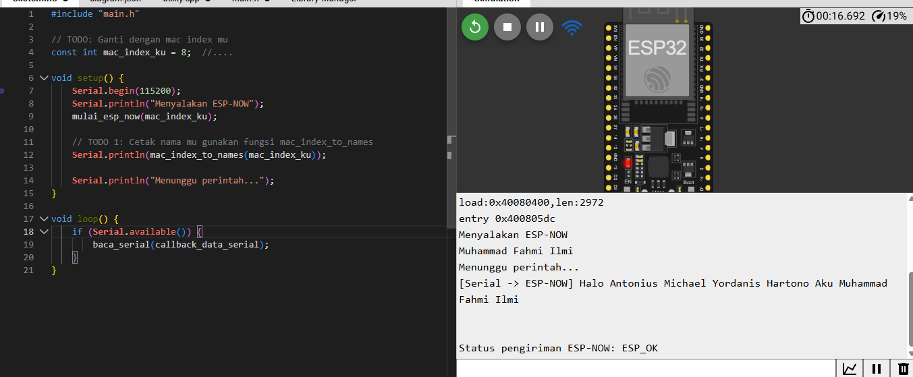

# Tugas Sapa-Menyapa ESP-NOW (ESP32)

## 😼 Deskripsi
Program ini dibuat untuk menjalankan komunikasi **sapa-menyapa** antar ESP32 menggunakan protokol **ESP-NOW**.  
Setiap perangkat ESP32 memiliki alamat **MAC Address unik** dan dapat saling mengirim pesan seperti `HALO`, `CEK`, dan `JAWAB`.

Program juga bisa menerima perintah melalui **Serial Monitor** dari laptop.

---

## 😺 Struktur File

- **include/**
  - `REDME` → File bawaan saat membuat file di platformIO.
- **src/**
  - `main.cpp` → File utama (setup & loop).
  - `utility.cpp` → Implementasi fungsi ESP-NOW.
  - `main.h` → Header Berisi Definisi fungsi dan enum.
- **lib/** → tempat library tambahan(file bawaan saat membuat project di PlatformIO).
- **data/** → File tambahan seperti konfigurasi(file bawaan saat membuat project di PlatformIO).
- **platformio.ini** → Konfigurasi PlatformIO.
- **README.md** → Dokumentasi proyek.

## TO-DO LIST

### 👌 TODO 1 - Cetak Identitas

Pada TO DO 1 ini kita dimminta untuk menampilkan nama teks berisi identitas kita.
**Caranya:**

1. Ubah dulu `mac_index_ku` yang ada di `main.cpp` sesuai index `mac_addresses` masing-masing.

    ```cpp
    const int mac_index_ku = 8; 

karena saya kebagian index 8 maka `mac_index-ku` saya ubah menjadi 8;

2. Pada file ``main.cpp`` dibagian setup (), tambahkan sebuah baris kode:

    ```cpp
    Serial.println(mac_index_to_names(mac_index_ku));

baris kode ini akan terlebih dahulu memanggil fungsi `mac_index_to_names` dengan parameter `mac_index_ku` dan kemudian hasilnya akan dicetak;

3. TODO 1 Selesai 😍

---

### 🤔 TODO 2 – Membaca Data dari Serial

Pada TODO 2 ini kita diminta untuk membuat perintah pemrosesan data yang akan diteri,a serial dari laptop.

Fungsi `baca_serial()` bertugas membaca data dari laptop melalui Serial Monitor.

**Format data dari Serial:**

|  Bagian  | Panjang  | Keterangan |
|----------|----------|------------|
| HEADER   | 3 Byte   | 0xFF 0xFF 0x00 (awal data)|
| LENGTH       | 1 Byte        | Banyaknya data(N)      |
| DATA       | N Byte        | Isi Data    |

**Contoh input di Serial Monitor (HEX):**

```
    FF FF 00 02 00 08
```
Keterangan:
- 0xFF 0xFF 0x00 → header
- 0x02 → panjang data = 2 byte
- 0x00 → perintah HALO
- 0x08 → tujuan = ESP dengan indeks 8 (Muhammad Fahmi Ilmi)

**Implementasi :**

```cpp
void baca_serial(void (*callback)(const uint8_t *data, int len)) {
    // TODO 2: implementasi kode buat nerima perintah dari serial
    if (Serial.available() >= 4) {
        // baca Header
        if (Serial.read() == 0xFF && Serial.read() == 0xFF && Serial.read() == 0x00) {
            int panjang_data = Serial.read(); // untuk ambil panjang data

            // memastikan data sudah siap dibaca
            while (Serial.available() < panjang_data) {
                delay(1);
            }

            // baca data sebanyak panjang_data
            uint8_t buffer[50]; // buffer untuk data
            for (int i = 0; i < panjang_data; i++) {
                buffer[i] = Serial.read();
            }

            // kirim ke fungsi callback
            callback(buffer, panjang_data);
        }
    }
}

```

😒 **Penjelasan :**

1. Mengecek apakah ada minimal 4 byte data (HEADER + LENGTH).
2. Membaca tiga byte pertama dan memastikan itu `0xFF 0xFF 0x00`.
3. Membaca 1 byte berikutnya sebagai panjang data (LENGTH).
4. Menunggu sampai semua data tersedia.
5. Menyimpan data ke buffer lalu memanggil `callback()` untuk diproses.

TODO 2 - DONE 😍

---

### 🤯 TODO 3 - Memproses pemerintah dari Serial & ESP-NOW

Fungsi `process_perintah()` bertugas membaca isi data dan menjalankan aksi sesuai jenis perintah.

```cpp
void process_perintah(const uint8_t *data, int len, int index_mac_address_asal) {
    // TODO 3: implementasi kode buat processing perintah
    uint8_t perintah = data[0]; //byte pertama itu kan kode perintah 
    uint8_t tujuan = data[1]; //byte  keuda beridi tujuan (index Mac)
    String Pesan = ""; //semisal ada data tambahan

    //jika len lebih dari 2 berarti ada data tambahan
    if (len > 2){
        for (int i = 2; i < len; i++){
            Pesan += (char)data[i];
        }
    }

    //nama pengirim dan tujuan
    String nama_pengirim = (index_mac_address_asal == 1) ? "Laptop" : mac_index_to_names(index_mac_address_asal);
    String nama_tujuan = mac_index_to_names(tujuan);

    //----------ini untuk pesan yang halo cek dan jawab--------------/
    if(perintah == 0x00){ // Ini artie perintah HALO
        if(index_mac_address_asal == -1){// ini buat pesan yang diterima dari serial
            String kirim = "HALO, Halo " + nama_tujuan + " Aku " + mac_index_to_names(mac_index_ku);
            esp_now_send(mac_addresses[tujuan], (uint8_t*)kirim.c_str(), kirim.length());
            Serial.println("[Serial] -> [ESP-NOW] " + kirim);
        }
        else {
            //diterima dari esp-now
            String jawaban = "JAWAB, Halo Juga " + nama_pengirim + " Aku " + mac_index_to_names(mac_index_ku);
            esp_now_send(mac_addresses[index_mac_address_asal], (uint8_t*)jawaban.c_str(), jawaban.length());
            Serial.println("[ESP-NOW] -> Balasan " + jawaban);
        }
    }

     else if(perintah == 0x01){ // ini utnuk perintah JAWAB
        if(index_mac_address_asal == -1){// ini buat pesan yang diterima dari serial
            String kirim = "CEK, " + nama_tujuan + " ini " + mac_index_to_names(mac_index_ku) + " apa kamu disana?";
            esp_now_send(mac_addresses[tujuan], (uint8_t*)kirim.c_str(), kirim.length());
            Serial.println("[Serial] -> [ESP-NOW] " + kirim);
        }
        else {
            //diterima dari esp-now
            String jawaban = "JAWAB, Iya Aku " + nama_pengirim + " Disini - " + mac_index_to_names(mac_index_ku);
            esp_now_send(mac_addresses[index_mac_address_asal], (uint8_t*)jawaban.c_str(), jawaban.length());
            Serial.println("[ESP-NOW] -> Balasan " + jawaban);
        }
    }

    else if(perintah == 0x02){ // ini utnuk perintah CEK
        if(index_mac_address_asal != -1){// ini buat pesan yang diterima dari serial
            Serial.print("[JAWAB DITERIMA] ");
            Serial.println(Pesan);
        }
    }

    else { // jika bukan HALO JAWAB ATAU CEK
        Serial.println("[PERINTAH TIDAK VALID] - HIDUP JOKOWI");
    }
}

```

**Penjelasan :**

1. data[0] → berisi kode perintah (HALO, CEK, atau JAWAB).
2. data[1] → berisi tujuan.
3. index_mac_address_asal == -1 artinya data datang dari Serial, bukan ESP-NOW.

**Setiap perintah punya logika:**

Perintah HALO:
- Jika menerima perintah HALO dari Serial, maka kirimkan packet perintah ke pengirim dengan format: "HALO(enum), 'Halo [Nama Tujuan] Aku [Namamu]'"
- Jika menerima perintah HALO dari ESP-NOW, maka kirimkan perintah JAWABAN ke tujuan pengirim dengan format "JAWAB(enum), 'Halo Juga [Nama Pengirim] Aku [Namamu]'".

Perintah CEK:

- Jika menerima perintah CEK dari Serial, maka kirimkan packet perintah ke pengirim dengan format: "CEK(enum), '[Nama tujuan] ini [Namamu] apa kamu disana?'"
- Jika menerima perintah CEK dari ESP-NOW, maka kirimkan perintah JAWABAN ke tujuan pengirim dengan format "JAWAB(enum), 'Iya Aku [Nama pengirim] Disini - [Namamu]'".

Perintah JAWAB:

- Perintah JAWAB cuma menerima dari ESP-NOW, cetak ke Serial Monitor String yang diterima".

JIKA TIDAK MEMENUHI ketinganya maka akan dicetak
```cpp
"[PERINTAH TIDAK VALID] - HIDUP JOKOWI"
```

TODO 3 DONE 😟

---

## 😵‍💫 Cara Menjalankan

1. Upload kode ke ESP32.
2. Buka Serial Monitor (115200 baud).
3. Ketik dan kirim data berformat:
```cpp
FF FF 00 02 01 02
```
contoh di atas: HEADER, LENGTH = 2, DATA = 01 02 → perintah CEK untuk tujuan ke-2.

4. Lihat pesan balasan di Serial Monitor.

---

## 🤫 Alur Program (Ringkas):

1. ESP32 menerima data dari laptop melalui Serial `(baca_serial())`.
2. Data diteruskan ke `process_perintah()` untuk diurai.
3. Jika perintah dari Serial → dikirim via ESP-NOW ke ESP32 lain.
4. Jika dari ESP-NOW → dibalas dan hasilnya ditampilkan di Serial Monitor.

----

## SIMULASI WOKWI


## SEKIAN - MAAF KALAU SALAH

----
